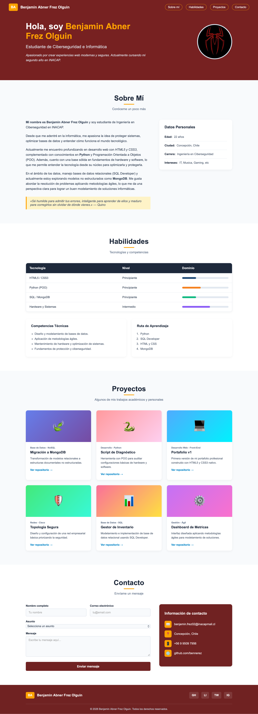

# Portafolio Personal - Benjamin Abner Frez Olguin

## 📄 Descripción
Este proyecto es un portafolio web personal estático, diseñado y desarrollado como parte de la evaluación práctica de Desarrollo Web Front-End. El sitio destaca mi perfil como estudiante de Ingeniería en Ciberseguridad en INACAP, estructurando mi información personal, habilidades técnicas, proyectos académicos y un formulario de contacto de manera profesional.

## 🛠️ Tecnologías Usadas
El proyecto fue construido puramente con tecnologías nativas web, cumpliendo con los estándares modernos:
* **HTML5:** Estructura basada en etiquetas semánticas (`<header>`, `<nav>`, `<main>`, `<section>`, `<article>`, `<aside>`, `<footer>`), uso de tablas estructuradas y formularios con validación nativa.
* **CSS3:** Diseño responsivo (Mobile-friendly) utilizando múltiples `@media queries` (Breakpoints de 1024px y 768px), **Flexbox** para alineación y **CSS Grid** para la galería de proyectos. Paleta de colores consistente e interfaz de usuario estilizada.

## 📸 Capturas de Pantalla
*(Nota para profesor: La página es 100% responsiva y se adapta a dispositivos de escritorio, tablets y móviles).*

## 🚀 Cómo ejecutar el proyecto
Al ser un proyecto Front-End estático, no requiere instalación de dependencias ni servidores locales. Para visualizarlo:

1. Clona este repositorio o descarga el código fuente en formato ZIP.
2. Descomprime los archivos en tu computadora.
3. Haz doble clic sobre el archivo `index.html` para abrirlo directamente en cualquier navegador web moderno (Google Chrome, Safari, Firefox, Edge).